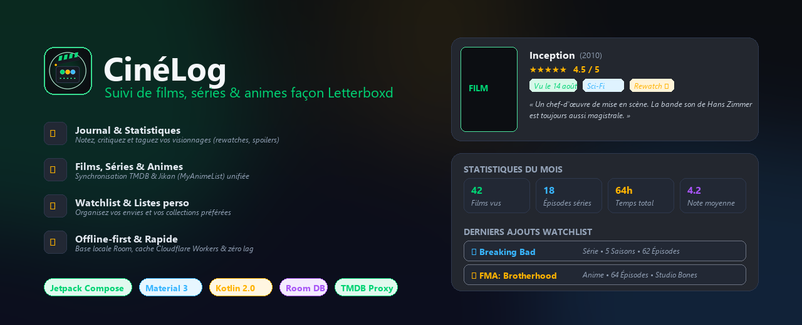

<div align="center">



# CinéLog 🎬

**Suivi de films, séries et animes façon Letterboxd sur Android.**

[](https://developer.android.com)
[](https://kotlinlang.org)
[](https://developer.android.com/jetpack/compose)
[](https://m3.material.io)
[](https://android-arsenal.com/api?level=24)

</div>

---

## 📱 À propos

**CinéLog** est une application Android moderne inspirée de Letterboxd, conçue pour vous permettre de journaliser, noter et organiser facilement vos visionnages de films, de séries télévisées et d'animes au sein d'une interface épurée et réactive au thème cinéma sombre.

L'application s'appuie sur les APIs de **[TMDB (The Movie Database)](https://www.themoviedb.org/)** pour les films et séries, et de **[Jikan (MyAnimeList)](https://jikan.moe/)** pour les animes.

---

## ✨ Fonctionnalités principales

- 📖 **Journal de bord (Diary) & Critiques** : Enregistrez chaque visionnage avec note sur 5 étoiles, critique, date, marqueur de rewatch, tags personnalisés et masquage des spoilers.
- 🎬 **Catalogue unifié (Films, Séries, Animes)** : Recherche instantanée, fiches détaillées, crédits de production, distribution, sagas/collections et gestion des saisons / épisodes.
- 📌 **Watchlist & Listes personnalisées** : Gardez une trace de ce que vous voulez voir et créez vos propres listes thématiques réorganisables.
- 📊 **Statistiques & Profil** : Visualisez votre activité (nombre de films et séries vus, temps total de visionnage, note moyenne, genres favoris).
- 🌓 **Design Dark Cinema & Fluidité** : Thème sombre Material 3 optimisé, animations soignées, mise en cache Coil avec fondu d'images et transitions fluides.
- ⚡ **Offline-First & Robustesse** : Persistance locale complète avec Room Database, migrations automatiques et données de secours en cas d'absence de réseau.
- 🌐 **Proxy TMDB Serverless intégré** : Prêt à l'emploi grâce à un Cloudflare Worker dédié qui porte la clé TMDB sans exiger de configuration de la part de l'utilisateur.

---

## 🚀 Installation & Démarrage rapide

### Prérequis

- [Android Studio](https://developer.android.com/studio) (Ladybug / Iguana ou version ultérieure recommandée)
- JDK 21
- Android SDK 36 (Build-Tools `36.0.0`, SDK minimal : API 24 `Android 7.0`)

### 1. Cloner le projet

```bash
git clone https://github.com/DZTic/CineLog.git
cd CineLog
```

### 2. Configuration (`.env`)

CinéLog utilise le plugin Gradle `secrets-gradle-plugin` pour charger sa configuration depuis un fichier `.env`.

Copiez le fichier d'exemple `.env.example` :

```bash
cp .env.example .env
```

Le fichier `.env` est déjà préconfiguré avec l'URL du proxy TMDB :

```properties
# URL de base du proxy Cloudflare Worker TMDB
TMDB_PROXY_BASE_URL="https://cinelog-tmdb-proxy.general-grievous0401.workers.dev"
```

> 💡 **Remarque** :
> L'application fonctionne immédiatement avec cette configuration par défaut sans nécessiter de clé API personnelle.
> Si vous souhaitez utiliser votre propre clé API TMDB, vous pouvez la renseigner directement dans l'application via l'onglet **Paramètres** (l'application basculera alors sur les appels TMDB directs).

### 3. Compilation et exécution

#### Avec Android Studio :
1. Ouvrez Android Studio.
2. Choisissez **Open** et sélectionnez le dossier racine du projet `CineLog`.
3. Laissez Gradle synchroniser les dépendances du projet.
4. Lancez l'application sur un émulateur ou un terminal physique connecté via le bouton **Run 'app'** (`Shift + F10`).

#### En ligne de commande :

```bash
# Compiler l'APK en mode Debug
./gradlew assembleDebug

# Lancer la suite de tests unitaires et le linter
./gradlew testDebugUnitTest lintDebug
```

---

## 🏗️ Architecture & Stack technique

- **Langage** : [Kotlin](https://kotlinlang.org/) (2.0+) avec Coroutines et Flow.
- **Interface graphique** : [Jetpack Compose](https://developer.android.com/jetpack/compose) avec Material 3 Design.
- **Architecture** : MVVM (Model-View-ViewModel) + Repository Pattern + Unidirectional Data Flow (`StateFlow`).
- **Base de données** : [Room](https://developer.android.com/training/data-storage/room) (SQLite local) avec schémas exportés et tests de migration.
- **Réseau** : [Retrofit 2](https://square.github.io/retrofit/) & [OkHttp 3](https://square.github.io/okhttp/) avec `Moshi` pour la sérialisation JSON.
- **Images** : [Coil](https://coil-kt.github.io/coil/) avec cache mémoire/disque et transitions `crossfade`.
- **Proxy Serverless** : Cloudflare Worker pour relayer les requêtes TMDB avec mise en cache edge (voir [`proxy/README.md`](proxy/README.md)).

---

## 📂 Structure du projet

```text
CineLog/
├── app/
│   ├── schemas/              # Schémas Room exportés pour les migrations
│   └── src/
│       ├── main/
│       │   ├── java/com/example/
│       │   │   ├── data/       # Modèles, Dao, Database, Services API & Repository
│       │   │   ├── ui/         # Composables Jetpack Compose (Home, Discover, Search, Detail...)
│       │   │   └── util/       # Utilitaires (DateFormatter, ImageUtils...)
│       │   └── res/            # Ressources Android (icônes, thèmes, chaînes)
│       └── test/               # Tests unitaires JVM, Compose et Robolectric
├── docs/
│   └── assets/                 # Visuels et captures d'écran du projet
├── proxy/                      # Cloudflare Worker proxy TMDB
└── .env.example                # Modèle des variables d'environnement
```

---

## 🤝 Contribution

Les contributions sont les bienvenues ! Pour proposer des améliorations ou corriger des bugs :

1. Forkez le dépôt.
2. Créez votre branche de fonctionnalité (`git checkout -b feature/ma-fonctionnalite` ou `codex/mon-correctif`).
3. Committez vos modifications (`git commit -m "feat: description de la fonctionnalite"`).
4. Poussez votre branche (`git push origin feature/ma-fonctionnalite`).
5. Ouvrez une **Pull Request**.

---

## 📄 Licence

Projet développé à des fins d'apprentissage et de démonstration. Les métadonnées de films et séries proviennent de [TMDB](https://www.themoviedb.org/) et les animes de [Jikan / MyAnimeList](https://jikan.moe/).
